<div align="center">


<h1>Sustainability & Cost Integration Platform</h1>

<p><strong>The Strategic FinOps & ESG Plane for Global Cloud Efficiency and Environmental Impact Optimization</strong></p>

[]()
[]()
[]()

<br/>

> **"You cannot optimize what you do not measure."** 
> Sustainability & Cost Integration (Green-Ops) is an enterprise-grade platform designed to provide a secure, measurable, and highly automated foundation for global cloud sustainability. It orchestrates the complex lifecycle of impact management—from multi-cloud cost ingestion and regional carbon estimation to real-time financial correlation, sustainability benchmarking, and strategic optimization recommendations. By providing a centralized command center with unified cost vs. carbon visibility, automated regional optimization, and immutable ESG reporting, it enables organizations to eliminate financial waste, reduce environmental footprints, and ensure consistent architectural excellence across every tier of the global IT infrastructure.

</div>

---

## 🏛️ Executive Summary

Cloud cost is a proxy for energy consumption; carbon is its consequence. Organizations fail to meet sustainability targets not because of a lack of commitment, but because of fragmented cost data, opaque carbon metrics, and an inability to correlate financial expenditure with environmental impact at the resource level.

This platform provides the **Sustainability Intelligence Plane**. It implements a complete **Green-Ops Framework**—from automated multi-cloud cost normalization and carbon estimation to a specialized impact dashboard and optimization hub. By operationalizing sustainability as a primary engineering metric, it ensures that your cloud infrastructure is not just "optimized," but continuously governed and delivered with strategic environmental precision.

---

## 🏛️ Core Platform Pillars

1. **Multi-Cloud Cost Normalization**: Centralized hub for ingesting and standardizing billing data from AWS, Azure, and GCP.
2. **Regional Carbon Estimation**: Intelligent engine that computes emissions based on usage metrics and regional carbon intensity profiles.
3. **Financial-Environmental Correlation**: Policy-driven engine that maps every dollar spent to its corresponding carbon footprint.
4. **Strategic Optimization Hub**: Automated generation of recommendations for rightsizing, regional migration, and green scheduling.
5. **Sustainability Benchmarking**: Strategic management of organizational ESG targets, ensuring every cloud initiative adheres to carbon budgets.
6. **Immutable ESG Reporting**: Long-term, searchable record of cost vs. carbon performance for compliance and stakeholder transparency.

---

## 📐 Architecture Storytelling: 50+ Advanced Diagrams

### 1. The Green-Ops Optimization Loop
*The flow from billing ingestion to carbon-aware optimization.*
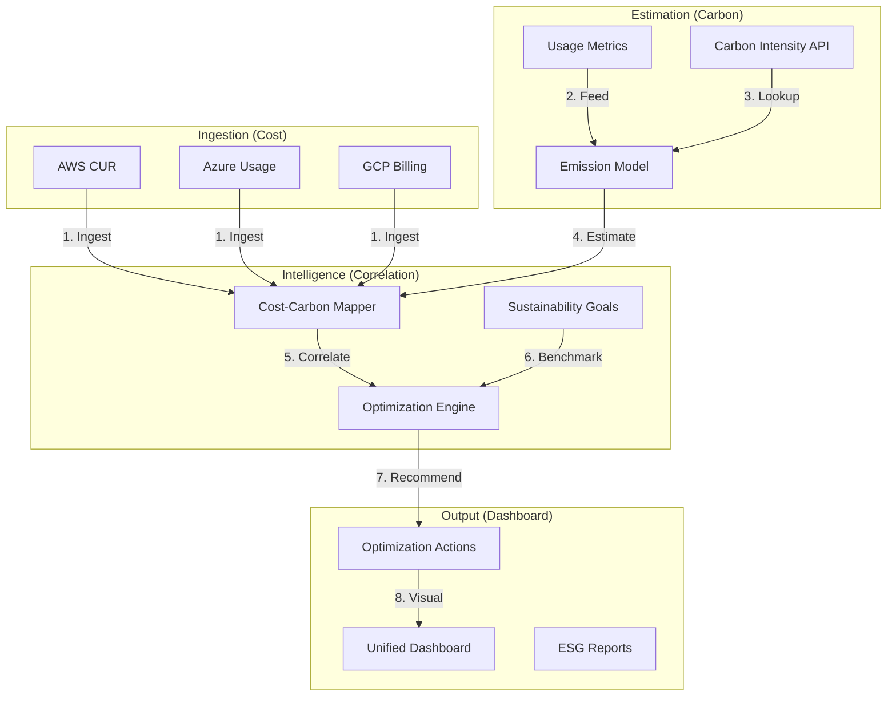

### 2. Carbon Estimation Pipeline
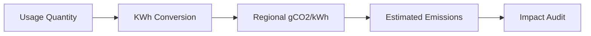

### 3. Workload Correlation Matrix
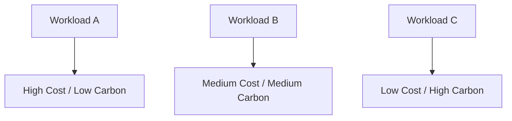

### 4. Sustainability Platform Architecture
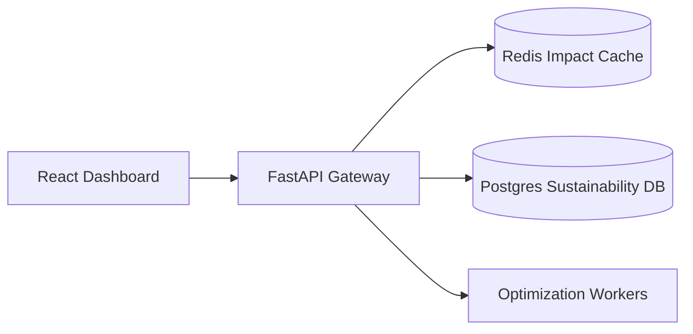

### 5. Deployment Topology: High-Available Impact Hub
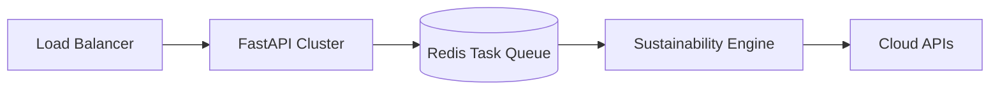

### 6. Optimization Recommendation Flow
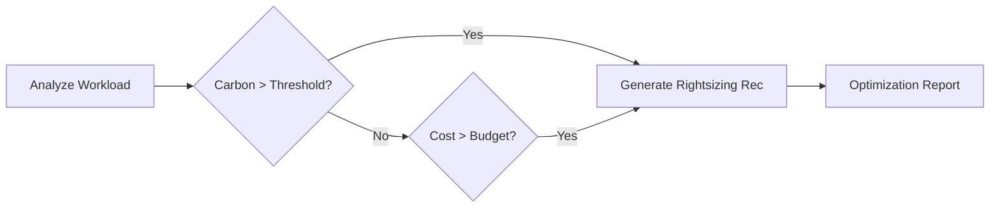

### 7. Foundation: Multi-Environment Setup
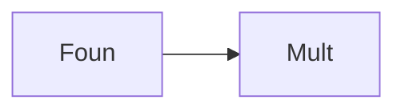

### 8. Networking: Secure Impact Tunnels
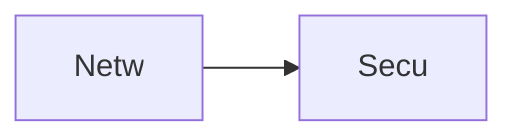

### 9. Component: Cost Engine
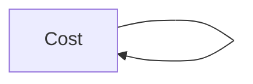

### 10. Component: Carbon Engine
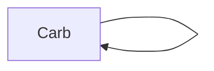

### 11. Component: Correlation Engine
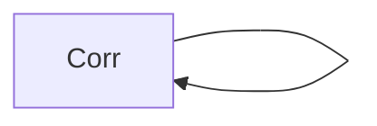

### 12. Component: Optimization Engine
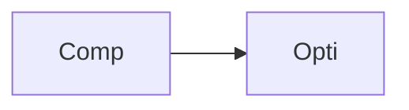

### 13. Logic: Normalization Logic
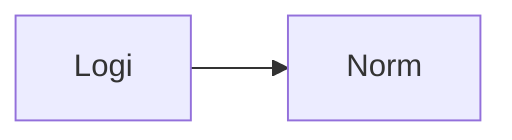

### 14. Logic: Emission Calculator
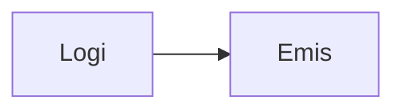

### 15. Logic: Goal Alignment Logic
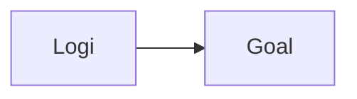

### 16. Logic: Recommendation Weighting
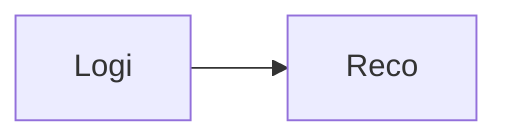

### 17. Architecture: Global Sustainability Plane
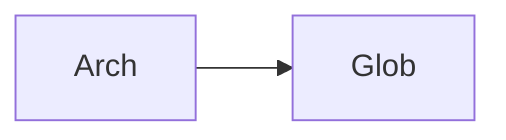

### 18. Architecture: Event-Driven FinOps
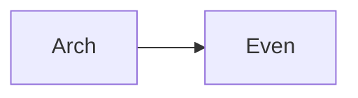

### 19. Architecture: Multi-Cloud Connector Bridge
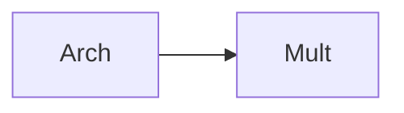

### 20. Pattern: Sustainability-as-Code
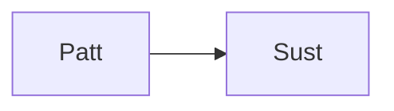

### 21. Pattern: Automated Reporting
```mermaid
graph LR
    P[Patt] --> A[Auto]
```

### 22. Pattern: Green-Ops Workflows
```mermaid
graph LR
    P[Patt] --> G[Gree]
```

### 23. Security: Signed Impact Statements
```mermaid
graph LR
    S[Secu] --> S[Sign]
```

### 24. Security: RBAC Sustainability Controls
```mermaid
graph LR
    S[Secu] --> R[RBAC]
```

### 25. Security: Secure Audit Record
```mermaid
graph LR
    S[Secu] --> S[Secu]
```

### 26. Feature: Unified Cost-Carbon View
```mermaid
graph LR
    F[Feat] --> U[Unif]
```

### 27. Feature: Regional Heatmap
```mermaid
graph LR
    F[Feat] --> R[Regi]
```

### 28. Feature: Auto-generated ESG PDFs
```mermaid
graph LR
    F[Feat] --> A[Auto]
```

### 29. Compliance: ESG Target Audits
```mermaid
graph LR
    C[Comp] --> E[ESGT]
```

### 30. Compliance: Audit Trail Persistence
```mermaid
graph LR
    C[Comp] --> A[Audi]
```

### 31. Infrastructure: Redis Goal Cache
```mermaid
graph LR
    I[Infr] --> R[Redi]
```

### 32. Infrastructure: Postgres Impact DB
```mermaid
graph LR
    I[Infr] --> P[Post]
```

### 33. Deployment: Kubernetes Analysis Pods
```mermaid
graph LR
    D[Depl] --> K[Kube]
```

### 34. Deployment: Multi-Region Impact Sync
```mermaid
graph LR
    D[Depl] --> M[Mult]
```

### 35. Monitoring: ingestion throughput KPI
```mermaid
graph LR
    M[Moni] --> I[Inge]
```

### 36. Monitoring: optimization accuracy latency
```mermaid
graph LR
    M[Moni] --> O[Opti]
```

### 37. UI: Unified Impact Dashboard
```mermaid
graph LR
    U[UI] --> U[Unif]
```

### 38. UI: Carbon Explorer UI
```mermaid
graph LR
    U[UI] --> C[Carb]
```

### 39. UI: Optimization Recommendation Portal
```mermaid
graph LR
    U[UI] --> O[Opti]
```

### 40. UI: Sustainability Goal Tracker
```mermaid
graph LR
    U[UI] --> S[Sust]
```

### 41. CI/CD: Impact validation pipeline
```mermaid
graph LR
    C[CICD] --> I[Impa]
```

### 42. CI/CD: Optimization engine tests
```mermaid
graph LR
    C[CICD] --> O[Opti]
```

### 43. Strategy: ESG-First Cloud Engineering
```mermaid
graph LR
    S[Stra] --> E[ESGF]
```

### 44. Strategy: Data-Driven Green-Ops
```mermaid
graph LR
    S[Stra] --> D[Data]
```

### 45. Feature: Multi-Currency Support
```mermaid
graph LR
    F[Feat] --> M[Mult]
```

### 46. Feature: Real-time Emission Alerts
```mermaid
graph LR
    F[Feat] --> R[Real]
```

### 47. Feature: Goal Attainment Scorecard
```mermaid
graph LR
    F[Feat] --> G[Goal]
```

### 48. Logic: Cost Normalization Engine
```mermaid
graph LR
    L[Logi] --> C[Cost]
```

### 49. Data Model: Impact Entity
```mermaid
graph LR
    D[Data] --> I[Impa]
```

### 50. Enterprise Sustainability Excellence
```mermaid
graph LR
    E[Entr] --> S[Sust]
```

---

## 🛠️ Technical Stack & Implementation

### Platform Engine & APIs
- **Framework**: Python 3.11+ / FastAPI.
- **Cost Engine**: Normalization and aggregation of multi-cloud billing records.
- **Carbon Engine**: Intelligent estimation of emissions using regional intensity profiles.
- **Correlation Engine**: Mapping of financial expenditures to environmental impacts.
- **Optimization Engine**: Rule-based generation of rightsizing and migration recommendations.
- **Cache**: Redis for high-speed goal tracking and report caching.
- **Persistence**: PostgreSQL for impact metadata, goal definitions, and audit records.
- **Processing**: Pandas for large-scale data manipulation and analysis.

### Frontend (Sustainability Dashboard)
- **Framework**: React 18 / Vite.
- **Theme**: Indigo / Slate (Modern ESG & FinOps aesthetic).
- **Visualization**: Recharts for cost-carbon correlation areas and regional intensity bars.

### Infrastructure
- **Runtime**: AWS EKS (Kubernetes).
- **Deployment**: Helm charts for analysis clusters and reporting workers.
- **IaC**: Terraform (Modular with FinOps & ESG focus).

---

## 🚀 Deployment Guide

### Local Development
```bash
# Clone the repository
git clone https://github.com/devopstrio/sustainability-cost-integration.git
cd sustainability-cost-integration

# Setup environment
cp .env.example .env

# Launch the Sustainability stack (API, Workers, DB, Redis, UI)
make up

# Trigger a multi-cloud cost ingestion simulation
make ingest-cost

# Run carbon analysis pipeline
make analyze-carbon
```
Access the Sustainability Hub at `http://localhost:3000`.

---

## 📜 License
Distributed under the MIT License. See `LICENSE` for more information.
