<div align="center">


<h1>Sustainability & Cost Integration Platform</h1>

<p><strong>The Strategic FinOps & ESG Plane for Global Cloud Efficiency and Environmental Impact Optimization.</strong></p>

[]()
[]()
[]()

<br/>

> **"You cannot optimize what you do not measure."** 
> **Sustainability & Cost Integration (Green-Ops)** is an institutional-grade platform designed to provide a secure, measurable, and highly automated foundation for global cloud sustainability. It orchestrates the entire lifecycle—from multi-cloud cost ingestion to real-time financial correlation and strategic optimization.

</div>

---

## 🏛️ Executive Summary

Cloud cost is a proxy for energy consumption; carbon is its consequence. Organizations often fail to meet sustainability targets not because of a lack of commitment, but because of fragmented cost data and an inability to correlate financial expenditure with environmental impact at the resource level.

This platform provides the **Sustainability Intelligence Plane**. It implements a complete **Green-Ops Framework**, enabling Finance and Engineering teams to manage cloud expenditures and carbon footprints as a single, unified metric. By automating the correlation of billing data with regional emission factors, we ensure that the cloud infrastructure is continuously governed with strategic precision.

---

## 📐 Architecture Storytelling: Principal Reference Models

### 1. Principal Architecture: Integrated Green-Ops & FinOps Intelligence Plane
This diagram illustrates the end-to-end flow from multi-cloud billing and telemetry ingestion to unified cost-carbon optimization and institutional reporting.

```mermaid
graph LR
    %% Subgraph Definitions
    subgraph BillingIngestion["Cloud Billing Ingestion (FinOps)"]
        direction TB
        AWS_CUR["AWS CUR / S3"]
        AZ_Usage["Azure Usage Details / API"]
        GCP_Bill["GCP Billing Export / BigQuery"]
    end

    subgraph EmissionIngestion["Environmental Telemetry (GreenOps)"]
        direction TB
        CloudCarbon["Cloud Carbon Coefficients"]
        GridIntensity["Regional Grid Intensity API"]
        PUE["Data Center PUE Metrics"]
    end

    subgraph Intelligence["Integrated Intelligence Engine"]
        direction TB
        API["FastAPI Integration Gateway"]
        Norm["Data Normalization Hub"]
        Corr["Cost-Carbon Correlation Engine"]
        Optimizer["Trade-off Optimization Engine"]
    end

    subgraph Reporting["Institutional ESG & Financial Hub"]
        direction TB
        Dash["Unified Green-Ops Dashboard"]
        ESG["ESG Compliance Report (TCFD)"]
        Finance["FinOps Budgeting & Forecasting"]
    end

    subgraph DevOps["Governance & IaC Orchestration"]
        direction TB
        GH["GitHub Actions (Policy Pipelines)"]
        TF["Terraform Governance Modules"]
        Tag["Unified Tagging Standards"]
    end

    %% Flow Arrows
    BillingIngestion -->|1. Billing Data| Norm
    EmissionIngestion -->|2. Emission Data| Norm
    Norm -->|3. Normalise| Corr
    Corr -->|4. Correlate| API
    
    API -->|5. Evaluate| Optimizer
    Optimizer -->|6. Recommend| Dash
    Dash -->|7. Plan| Finance
    Dash -->|8. Generate| ESG
    
    GH -->|9. Enforce| TF
    TF -->|10. Standardise| Tag
    Tag -->|11. Inject Tags| BillingIngestion

    %% Styling
    classDef finops fill:#f5f5f5,stroke:#616161,stroke-width:2px;
    classDef greenops fill:#e8f5e9,stroke:#1b5e20,stroke-width:2px;
    classDef intel fill:#ede7f6,stroke:#311b92,stroke-width:2px;
    classDef report fill:#fce4ec,stroke:#880e4f,stroke-width:2px;
    classDef devops fill:#fffde7,stroke:#f57f17,stroke-width:2px;

    class BillingIngestion finops;
    class EmissionIngestion greenops;
    class Intelligence intel;
    class Reporting report;
    class DevOps devops;
```

### 2. The Cost-Carbon Correlation Loop: Usage to Impact
The automated path for mapping every dollar spent to its corresponding environmental footprint.

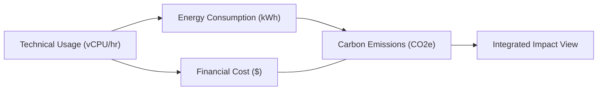

### 3. Data Normalization Hub: Multi-Cloud Billing Standards
Mapping disparate billing schemas from major providers into a unified internal model.

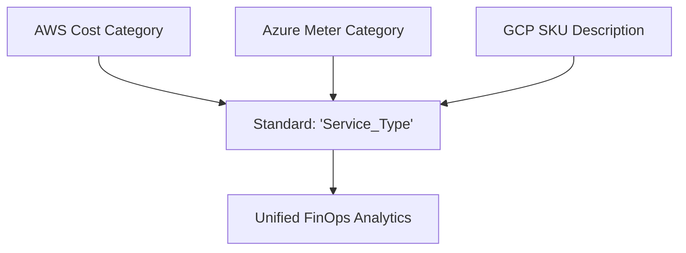

### 4. Unit Economics Model: Efficiency at Scale
Tracking the efficiency of cloud spend through the lens of environmental impact.

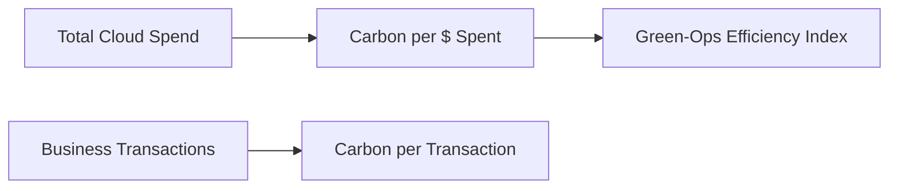

### 5. Multi-Cloud Impact Ingestion Pipeline
Scaling the data ingestion plane across global regions and diverse cloud accounts.

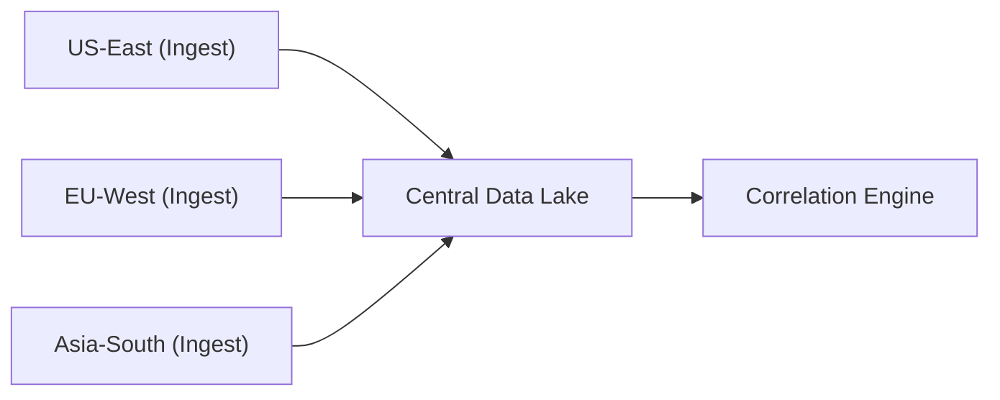

### 6. Optimization Trade-off Engine: The Decision Matrix
Analyzing the relationship between cost savings, carbon reduction, and performance requirements.

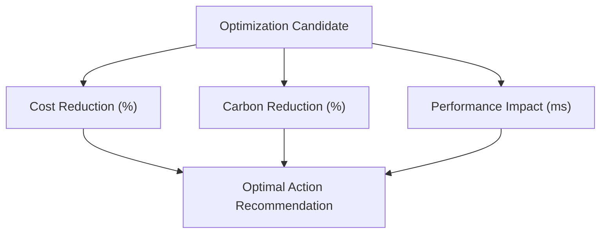

### 7. Automated Forecasting & Budgeting
Predicting future financial and environmental trajectories based on historical trends.

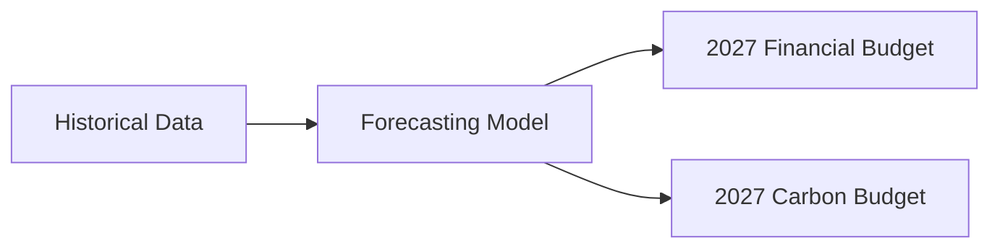

### 8. Identity & RBAC for Integrated Ops
Managing shared access for Financial Analysts and Sustainability Leads.

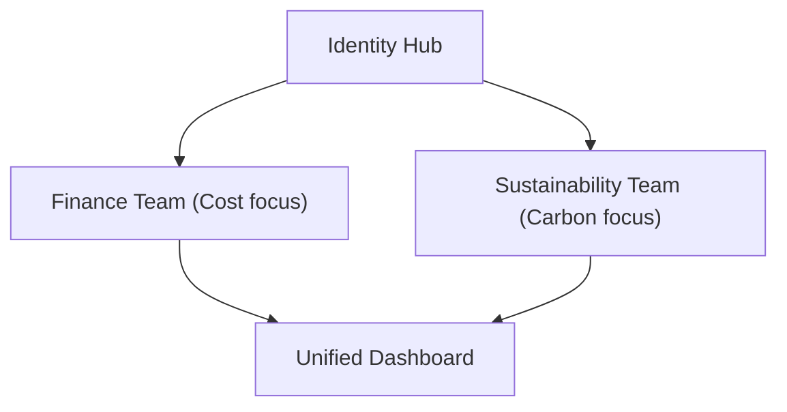

### 9. Compliance & ESG Audit Trail
Providing immutable evidence for institutional financial and environmental audits.

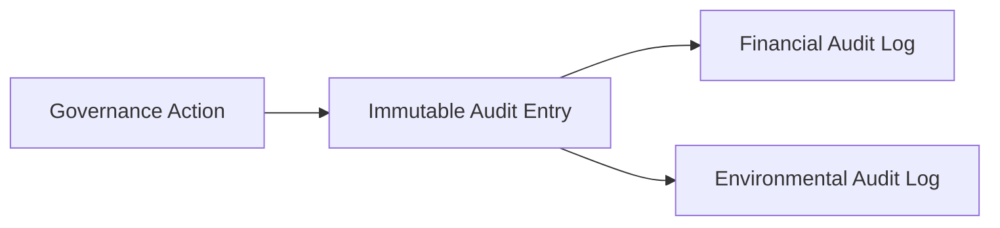

### 10. IaC Integrated Governance: Unified Tagging
Ensuring every resource is born with the tags required for both FinOps and GreenOps.

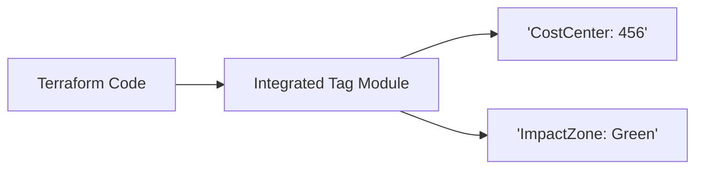

### 11. Metadata Lake for Forensic Analysis
Historical storage for cross-referencing past billing cycles with grid intensity data.

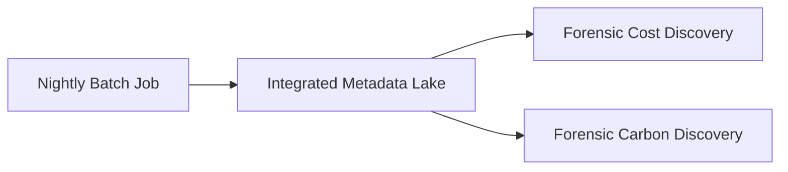

---

## 🏛️ Core Platform Pillars

1.  **Multi-Cloud Cost Normalization**: Centralized hub for ingesting and standardizing billing data from AWS, Azure, and GCP.
2.  **Regional Carbon Estimation**: Intelligent engine that computes emissions based on usage metrics and regional carbon intensity profiles.
3.  **Financial-Environmental Correlation**: Policy-driven engine that maps every dollar spent to its corresponding carbon footprint.
4.  **Strategic Optimization Hub**: Automated generation of recommendations for rightsizing, migration, and green scheduling.
5.  **Sustainability Benchmarking**: Strategic management of organizational ESG targets and carbon budgets.
6.  **Immutable ESG Reporting**: Long-term, searchable record of cost vs. carbon performance for compliance.

---

## 🛠️ Technical Stack & Implementation

### Platform Engine & APIs
*   **Framework**: Python 3.11+ / FastAPI.
*   **Cost Engine**: BigQuery and Athena connectors for large-scale billing data processing.
*   **Carbon Engine**: Intelligent mapping using regional grid intensity and PUE data.
*   **Correlation Engine**: Dynamic mapping of usage records to financial and environmental impacts.
*   **Analytics**: Pandas and NumPy for high-performance data transformation.

### Integrated Dashboard (UI)
*   **Framework**: React 18 / Vite.
*   **Theme**: Indigo / Slate (Modern ESG & FinOps aesthetic).
*   **Visualization**: Recharts for integrated cost-carbon trend lines and regional heatmaps.

### Infrastructure & DevOps
*   **Runtime**: AWS EKS or Azure Kubernetes Service (AKS).
*   **IaC**: Modular Terraform for deploying the integration hub and analysis pipelines.

---

## 🏗️ IaC Mapping (Module Structure)

| Module | Purpose | Real Services |
| :--- | :--- | :--- |
| **`infrastructure/integration`** | Central management plane | EKS, PostgreSQL, Redis |
| **`infrastructure/ingestion`** | Cloud billing connectors | S3, Athena, BigQuery, CUR |
| **`infrastructure/analysis`** | Cost-carbon compute nodes | Python Workers, Pandas, Spark |
| **`infrastructure/governance`** | Unified tagging guardrails | Azure Policy, AWS Config, SCPs |

---

## 🚀 Deployment Guide

### Local Principal Environment
```bash
# Clone the integration platform
git clone https://github.com/devopstrio/sustainability-cost-integration.git
cd sustainability-cost-integration

# Configure environment
cp .env.example .env

# Launch the Integration stack
make up

# Trigger a multi-cloud cost ingestion simulation
make ingest-cost

# Run carbon correlation analysis
make analyze-impact
```

Access the Integrated Impact Hub at `http://localhost:3000`.

---

## 📜 License
Distributed under the MIT License. See `LICENSE` for more information.

---
<div align="center">
  <p>© 2026 Devopstrio. All rights reserved.</p>
</div>
